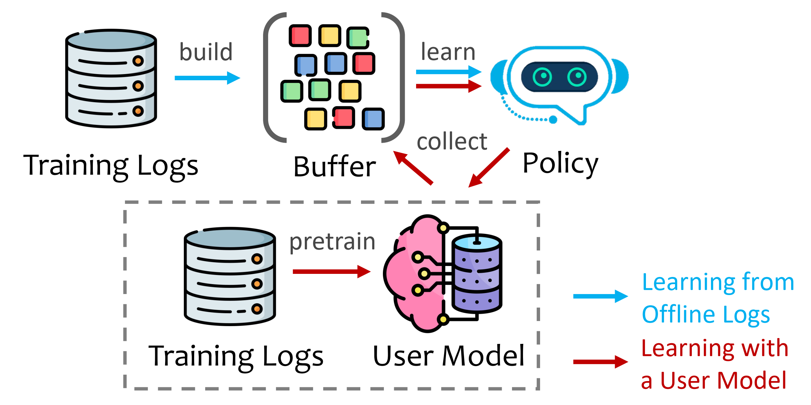
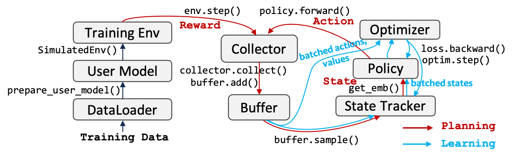

## Implementation Details

#### **Collector**:

The Collector module serves as a crucial link facilitating interactions between Environment and Policy, responsible for collecting interaction trajectories into Buffer.

Considering a complete interaction from time $1$ to time $T$,  the observations, actions, and rewards at each timestamp, denoted as  $\{(o_1, a_1, r_1), ..., (o_T, a_T, r_T)\}$, would be considered as one single trajectory and stored in Buffer.

Visualzation of data/trajectories stored in Buffer, which support simultaneous interactions in multiple environments:

### Training

EasyRL4Rec offers two training settings: 

#### 1. Learning with a User Model (i.e., reward model)

This setting is similar to ChatGPT's RLHF learning paradigm, in which a reward model is learned in advanced to capture users' preferences and then is used to guide the learning of any RL policy.

Its learning pipeline is as the following figure. We first learn a user model $\phi_M$ via supervised learning (which is a traditional recommendation model such as DeepFM), and use $\phi_M$ to provide rewards for learning the core policy $\pi_\theta$.

The implementation of this paradigm in this package is as follows:

#### 2. Learning directly from offline logs

This setting assume all data are users' behavior logs (instead of ratings). The policy directly learns from offline logs, which have been collected in the Buffer in advance. 
Hence, the classic offline RL methods such as BCQ, CQL, and CRR can be learned directly on such data. 

In EasyRL4Rec, we implement three buffer construction methods: 

* Sequential: logs would be split in chronological order. 
* Convolution: logs would be augmented through convolution. 
* Counterfactual: logs would be randomly shuffled over time. 

Note that compared with the first setting, this setting has no planning stage in training. And its implementation is as follows:

---

### Offline Evaluation

In offline evaluation, we cannot obtain users' real-time feedback towards the recommended items. The are two options that we can choose to construct the test environment:

      1. Option 1: Use the offline test data to evaluate the policy directly through off-policy evaluation, such as [paper](https://arxiv.org/abs/2212.02779), [paper](https://arxiv.org/abs/2206.02620).
      2. Option 2: Creat a simulated environment using a simulated model. For example, using a MF model to predict the missing values in the user-itemp matrix ([paper](https://dl.acm.org/doi/10.1145/3383313.3412252)) and define a certain quit mechanism for ending the interaction, such as [KuaiEnv](https://github.com/chongminggao/CIRS-codes/#kuaishouenv). 

The implementation is as follows:

